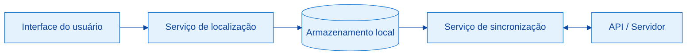

<div align="center">


<br/>


</div>

---

## Sumário

- [Visão geral](#visão-geral)
- [Principais recursos](#principais-recursos)
- [Arquitetura](#arquitetura)
- [Tecnologias](#tecnologias)
- [Pré-requisitos](#pré-requisitos)
- [Instalação](#instalação)
- [Configuração](#configuração)
- [Uso](#uso)
- [Estrutura do projeto](#estrutura-do-projeto)
- [Testes](#testes)
- [Roadmap](#roadmap)
- [Contribuição](#contribuição)
- [Licença](#licença)
- [Contato](#contato)

---

## Visão geral

<!-- AJUSTE: descreva o problema que o projeto resolve e para quem ele foi feito -->
O **Geo Sync Mobile** é um aplicativo mobile voltado à coleta de dados de localização e à sincronização confiável dessas informações com um servidor central.

O projeto foi desenhado para operar em cenários de conectividade instável: os dados são armazenados localmente e enviados assim que a conexão é restabelecida, evitando perdas e duplicidades.

## Principais recursos

<!-- AJUSTE: mantenha apenas o que o app realmente faz -->
| Recurso | Descrição |
|---|---|
| Captura de localização | Obtenção de coordenadas geográficas do dispositivo em tempo real |
| Sincronização | Envio e recebimento de dados entre o app e o servidor |
| Modo offline | Armazenamento local com sincronização posterior |
| Visualização em mapa | Exibição dos pontos coletados em mapa interativo |
| Autenticação | Acesso restrito a usuários cadastrados |

## Arquitetura

<!-- AJUSTE: adapte o diagrama ao fluxo real do seu app -->


**Fluxo resumido:** a interface solicita a localização ao serviço dedicado, os dados são persistidos localmente e o serviço de sincronização os envia ao servidor quando há conexão disponível.

## Tecnologias

<!-- AJUSTE: substitua pela stack real do projeto -->
| Camada | Tecnologia |
|---|---|
| Aplicativo | Flutter / Dart |
| Armazenamento local | SQLite |
| Comunicação | REST API |
| Controle de versão | Git e GitHub |

## Pré-requisitos

Antes de começar, verifique se você possui instalado:

- [Git](https://git-scm.com/) 2.30 ou superior
- [Flutter SDK](https://docs.flutter.dev/get-started/install) (canal estável)
- Android Studio ou Xcode, com emulador ou dispositivo físico configurado

## Instalação

```bash
# Clonar o repositório
git clone https://github.com/mariaclaraluz0/geo_sync_mobile.git

# Acessar o diretório do projeto
cd geo_sync_mobile

# Instalar as dependências
flutter pub get
```

## Configuração

<!-- AJUSTE: informe as variáveis/arquivos de configuração que o projeto exige -->
Crie um arquivo `.env` na raiz do projeto com base no modelo abaixo:

```env
API_BASE_URL=https://sua-api.exemplo.com
API_KEY=sua_chave_aqui
```

> **Importante:** nunca versione o arquivo `.env`. Confirme que ele está listado no `.gitignore`.

## Uso

```bash
# Executar em modo de desenvolvimento
flutter run

# Gerar build de produção (Android)
flutter build apk --release
```

## Estrutura do projeto

<!-- AJUSTE: adapte para a estrutura real de pastas -->
```
geo_sync_mobile/
├── lib/
│   ├── models/        # Modelos de dados
│   ├── screens/       # Telas do aplicativo
│   ├── services/      # Localização, API e sincronização
│   ├── widgets/       # Componentes reutilizáveis
│   └── main.dart      # Ponto de entrada
├── assets/            # Imagens e recursos estáticos
├── docs/              # Documentação e capturas de tela
├── test/              # Testes automatizados
└── pubspec.yaml       # Dependências e metadados
```

## Testes

```bash
flutter test
```

## Roadmap

- [x] Estrutura inicial do projeto
- [ ] Captura de localização em segundo plano
- [ ] Sincronização incremental
- [ ] Resolução de conflitos de dados
- [ ] Exportação de dados (CSV/GeoJSON)
- [ ] Testes de integração

## Contribuição

Contribuições são bem-vindas. Para colaborar:

1. Faça um fork do repositório.
2. Crie uma branch a partir da `main`: `git checkout -b feature/nome-da-feature`
3. Realize os commits seguindo o padrão [Conventional Commits](https://www.conventionalcommits.org/pt-br/): `git commit -m "feat: descrição da alteração"`
4. Envie a branch: `git push origin feature/nome-da-feature`
5. Abra um Pull Request descrevendo as mudanças realizadas.

## Licença

Distribuído sob a licença MIT. Consulte o arquivo [LICENSE](LICENSE) para mais informações.

## Contato

**Maria Clara Luz**

[](https://github.com/mariaclaraluz0)

Link do projeto: [github.com/mariaclaraluz0/geo_sync_mobile](https://github.com/mariaclaraluz0/geo_sync_mobile)

---

<div align="center">
<sub>Desenvolvido por Maria Clara Luz</sub>
</div>
