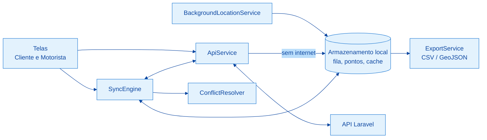

<div align="center">


<br/>


</div>

---

## Sumário

- [Visão geral](#visão-geral)
- [Novidades desta versão](#novidades-desta-versão)
- [Principais recursos](#principais-recursos)
- [Arquitetura](#arquitetura)
- [Tecnologias](#tecnologias)
- [Pré-requisitos](#pré-requisitos)
- [Instalação](#instalação)
- [Configuração](#configuração)
- [API esperada (backend)](#api-esperada-backend)
- [Permissões](#permissões)
- [Uso](#uso)
- [Estrutura do projeto](#estrutura-do-projeto)
- [Testes](#testes)
- [Solução de problemas](#solução-de-problemas)
- [Segurança e privacidade](#segurança-e-privacidade)
- [Roadmap](#roadmap)
- [Contribuição](#contribuição)
- [Licença](#licença)
- [Contato](#contato)

---

## Visão geral

O **Geo Sync Mobile** é um aplicativo Flutter de logística que conecta **clientes** e **motoristas**. O cliente acompanha suas remessas, alertas e a frota no mapa. O motorista aceita entregas, atualiza o status e tem a localização rastreada, **inclusive com o app em segundo plano e sem internet**.

O app funciona no modelo *offline-first*: as alterações feitas sem conexão ficam em uma fila local e são enviadas à API Laravel quando a internet volta. Se houver conflito com o servidor, ele é resolvido por regras definidas.

Uma única base de código atende Android e iOS. Também roda em Windows e no navegador, o que é útil no desenvolvimento e na exportação de dados.

## Novidades desta versão

| Área | O que mudou |
|---|---|
| **Autenticação** | O token salvo é validado com `auth/me` ao abrir o app. Token expirado ou revogado encerra a sessão, e sem internet a sessão offline é mantida. "Esqueci a senha" agora envia um link real por e-mail (`auth/forgot-password`). |
| **Exportação** | Nova folha "Exportar dados": mostra quantos registros há em cada opção, **salva o arquivo** no computador (*Salvar como…*) ou **baixa** no navegador, e **compartilha** no celular. As remessas são sincronizadas antes de exportar. |
| **Editar perfil** | Tela redesenhada com cartões por seção, máscara de telefone, validação em tempo real, foto com remoção, aviso de alterações não salvas e layout em duas colunas no tablet. |
| **Alterar senha** | Medidor de força, lista de requisitos que é marcada enquanto você digita, confirmação visual e suporte a gerenciadores de senha. Mínimo de 8 caracteres. |
| **Meu veículo** | Cartão com prévia ao vivo e placa no padrão Mercosul. Os dados agora **ficam salvos no aparelho** (antes eram perdidos ao reiniciar). |
| **Área do cliente** | Aba *Carteira* removida. A navegação ficou com Início, Remessas, Mapa e Alertas. |
| **Área do motorista** | Ícones unificados na família *Rounded* do Material. |
| **Responsividade** | Todas as telas foram auditadas de 320 px até tablet, com fonte ampliada e temas claro e escuro, sem nenhum overflow. Botões têm altura mínima de 48 px. |
| **Modo escuro** | Corrigidos textos ilegíveis (texto escuro sobre fundo escuro) no login, no cadastro, nas entregas, nos alertas e no mapa, além do SnackBar do tema claro. |
| **Erros do servidor** | Erros 5xx (ex.: SQL do Laravel) não aparecem mais crus para o usuário. O detalhe técnico vai para o log `[API]`. |

## Status do projeto: fases concluídas

As etapas de evolução do app foram concluídas mantendo a arquitetura existente e sem quebrar o comportamento atual.

### Fase 1 — Comprovante digital + ocorrências
- Comprovante de entrega com foto, latitude/longitude automáticas, horário, nome do destinatário, assinatura do destinatário e observação opcional.
- Registro de ocorrência com categorias pré-definidas e foto opcional.
- Persistência offline-first com fila local e sincronização ao reconectar.
- Uso de idempotência local (`client_id`) para evitar duplicação ao reenviar.

### Fase 2 — Notificações + QR Code
- Geração e leitura de QR Code de remessa.
- Acesso direto ao fluxo de remessa pela tela de detalhes.
- Payload seguro sem expor dados sensíveis do cliente/frete.
- Integração visual com a mesma linguagem do app e suporte a navegação sem quebrar o fluxo principal.

### Fase 3 — ETA + detecção de atraso
- Estimativa de chegada com base em progresso da entrega, distância e GPS atual.
- Indicador de possível atraso com margem de tolerância para evitar falsos alertas.
- Cálculo local e fallback conservador quando a API de rota não está disponível.

### Fase 4 — Otimização de rotas
- Sugestão offline de ordem por coordenadas geográficas, vizinho mais próximo e refinamento 2-opt; marcada como aproximada quando faltam coordenadas. Distância em linha reta não substitui uma rota por ruas.
- A estimativa usa a posição atual e coordenadas `latitude`/`longitude` (ou `lat`/`lng`) nas remessas. Para distância e tempo realistas, o backend precisa fornecer matriz de rotas considerando ruas, trânsito e restrições.
- Exibição de ordem, distância total, tempo estimado, destino atual e próximo destino.
- Melhor experiência para o motorista sem trocar a arquitetura atual.

### Fase 5 — Dashboard de desempenho
- Indicadores de total, concluídas, pendentes/em andamento, atrasadas, ocorrências, distância e tempo médio.
- Filtros por Hoje, últimos 7 dias e últimos 30 dias.
- Gráfico de tendência simples e responsivo, funcionando com dados locais em offline.

### Observações importantes
- O backend Laravel real não está presente neste checkout; então qualquer integração com endpoint novo foi tratada com compatibilidade local e sem inventar contratos inexistentes.
- O app continua funcionando de maneira offline-first, com sincronização e fila local preservadas.
- As mudanças foram feitas de forma incremental, sem reescrever a arquitetura principal do produto.

## Principais recursos

| Recurso | Descrição |
|---|---|
| Autenticação | Login e cadastro de cliente ou motorista, validação da sessão, logout e recuperação de senha |
| Remessas | Listagem, filtros, detalhes, histórico e registro de ocorrências |
| Rastreamento em segundo plano | GPS contínuo durante a entrega (*foreground service* no Android e modo *background location* no iOS), com filtro de precisão e modo economia |
| Sincronização incremental | Envia `updated_since` para baixar só o que mudou e faz uma sincronização completa periódica (30 min) para detectar exclusões |
| Fila offline | Ações feitas sem internet (aceitar entrega, mudar status) e pontos de GPS são gravados localmente e enviados depois |
| Resolução de conflitos | Regras por status e data. O histórico de conflitos resolvidos fica visível nas configurações do motorista |
| Mapa | Mapa interativo (`flutter_map`) com a posição e as remessas ativas |
| Exportação | Localizações e remessas em **CSV** (Excel/Planilhas) ou **GeoJSON** (QGIS, geojson.io, Google Earth) |
| Perfil e veículo | Edição de dados pessoais, foto, senha e dados do veículo |
| Tema | Claro e escuro, com layout responsivo para celular, tablet e desktop |

## Arquitetura


```mermaid
%%{init: {'theme':'base','themeVariables':{'primaryColor':'#E3F2FD','primaryBorderColor':'#1976D2','primaryTextColor':'#0D47A1','lineColor':'#0D47A1','secondaryColor':'#BBDEFB'}}}%%
flowchart LR
    UI[Telas<br/>Cliente e Motorista] --> API[ApiService]
    UI --> SYNC[SyncEngine]
    GPS[BackgroundLocationService] --> STORE[(Armazenamento local<br/>fila, pontos, cache)]
    API -- sem internet --> STORE
    SYNC <--> STORE
    SYNC --> CR[ConflictResolver]
    SYNC <--> API
    API <--> BE[API Laravel]
    STORE --> EXP[ExportService<br/>CSV / GeoJSON]
```

**Fluxo resumido:**

1. As telas chamam o `ApiService`. Sem conexão, as ações do motorista vão para a fila local (`PendingQueue`).
2. O `BackgroundLocationService` grava cada leitura de GPS no aparelho **antes** de qualquer envio, então nada se perde offline.
3. O `SyncEngine` roda a cada 2 minutos e sempre que o app volta ao primeiro plano. Ele baixa as alterações, aplica o `ConflictResolver`, envia a fila e os pontos de GPS em lotes.
4. O `ExportService` gera os arquivos a partir dos dados locais.

## Tecnologias

| Finalidade | Tecnologia |
|---|---|
| Aplicativo | Flutter / Dart (`^3.10.8`) |
| Mapas | `flutter_map`, `latlong2` |
| Localização | `geolocator` (inclusive em segundo plano) |
| Câmera e galeria | `image_picker` |
| Comunicação | `http` (REST API Laravel com token Bearer/Sanctum) |
| Armazenamento local | SQLite (`sqflite`) com payloads AES-GCM em Android/iOS/macOS, migração do JSON legado e chave no `flutter_secure_storage` |
| Exportação | `share_plus` (compartilhar) e `file_selector` (*Salvar como…*) |
| Qualidade | `flutter_lints`, `flutter_test`, `integration_test` |
| Controle de versão | Git e GitHub |

## Pré-requisitos

- [Git](https://git-scm.com/) 2.30 ou superior
- [Flutter SDK](https://docs.flutter.dev/get-started/install) (canal estável, compatível com Dart `^3.10.8`)
- Para celular: Android Studio ou Xcode, com emulador ou dispositivo físico
- Para Windows: Visual Studio com *Desktop development with C++* e o **Modo de desenvolvedor** ativado (*Configurações → Sistema → Para desenvolvedores*), exigido pelos plugins
- O backend Laravel do GeoSync em execução (veja [API esperada](#api-esperada-backend))

Confira o ambiente com `flutter doctor`.

## Instalação

```bash
# Clonar o repositório
git clone https://github.com/mariaclaraluz0/geo_sync_mobile.git

# Acessar o diretório do projeto
cd geo_sync_mobile

# Instalar as dependências
flutter pub get
```

## Configuração

A URL da API (incluindo o sufixo `/api`) pode ser definida de duas formas.

**1. Na execução**, com `--dart-define`:

```bash
flutter run --dart-define=API_BASE_URL=http://192.168.0.10:8000/api
```

**2. Dentro do app**, na tela de login, em **Configurar servidor da API**. O valor fica salvo no aparelho e é usado nas próximas execuções.

> **Dica:** em emulador Android, `localhost` aponta para o próprio emulador. Use o IP da máquina na rede (ex.: `192.168.0.10`) ou `10.0.2.2`.

> **Importante:** nunca versione chaves, tokens ou URLs de produção no repositório.

## API esperada (backend)

O arquivo [`openapi.yaml`](openapi.yaml) registra um rascunho do contrato esperado
para sincronização e autenticação. O teste `test/api_contract_test.dart` confere
as operações principais do arquivo. O backend Laravel não está neste checkout;
por isso, compatibilidade real precisa ser validada ao conectar o servidor.

Principais rotas usadas pelo app (prefixo `/api`, autenticação por `Authorization: Bearer <token>`):

| Grupo | Rotas |
|---|---|
| Autenticação | `POST auth/login`, `POST auth/register`, `GET auth/me`, `POST auth/logout`, `POST auth/forgot-password`, `PUT perfil` |
| Remessas | `GET remessas/minhas?updated_since=<ISO-8601>`, `GET remessas/disponiveis`, `POST remessas/{id}/aceitar`, `PATCH remessas/{id}/status`, `GET remessas/{id}/historico` |
| Localização | `POST localizacao`, `GET localizacao`, `GET localizacao/remessa/{id}`, `GET localizacao/remessa/{id}/ultima` |
| Motorista | `GET motorista/avisos`, `PATCH motorista/avisos/{id}/lido`, `PATCH motorista/avisos/lidos`, `GET motorista/documentos` |
| Outros | `alertas`, `avaliacoes`, `contatos` |

Para a sincronização funcionar bem, recomenda-se que o backend:

- devolva `updated_at` em cada remessa e, se possível, `meta.server_time`, que o app usa como cursor da sincronização incremental;
- trate `POST localizacao` como idempotente pelo campo `client_id`, pois o mesmo ponto pode ser reenviado depois de uma falha de rede;
- responda `409` quando uma alteração de status for recusada por conflito.

## Permissões

| Plataforma | Arquivo | Permissões |
|---|---|---|
| Android | `android/app/src/main/AndroidManifest.xml` | `INTERNET`, `ACCESS_FINE_LOCATION`, `ACCESS_COARSE_LOCATION`, `FOREGROUND_SERVICE`, `FOREGROUND_SERVICE_LOCATION`, `WAKE_LOCK`, `POST_NOTIFICATIONS` |
| iOS | `ios/Runner/Info.plist` | `NSLocationWhenInUseUsageDescription`, `NSLocationAlwaysAndWhenInUseUsageDescription`, `UIBackgroundModes: location` |

No Android, o rastreamento em segundo plano roda como *foreground service*, com a notificação fixa "GeoSync está rastreando sua entrega". Por isso ele não exige a permissão de localização "o tempo todo".

## Uso

### Publicação Android e iOS

Antes de publicar Android, escolha o identificador de pacote registrado para o aplicativo. No PowerShell, defina `$env:ORG_GRADLE_PROJECT_geoSyncApplicationId="com.suaorganizacao.geosync"` antes de rodar o build. Configure a assinatura em `android/key.properties` com `storeFile`, `storePassword`, `keyAlias` e `keyPassword`; esse arquivo e os keystores são ignorados pelo Git. Sem esse arquivo, o build release não usa a chave de debug e não está pronto para distribuição. Configure também o Bundle Identifier oficial no Xcode para iOS. Nunca versione chaves de assinatura.

```bash
# Executar em modo de desenvolvimento
flutter run --dart-define=API_BASE_URL=<url-da-api>

# Executar no Windows ou no navegador
flutter run -d windows
flutter run -d chrome

# Gerar build de produção (Android)
flutter build apk --release

# Gerar bundle para a Play Store
flutter build appbundle --release

# Gerar build iOS
flutter build ipa --release
```

**Exportar dados (motorista):** *Perfil → Configurações → Exportar dados*. Escolha **Localizações** ou **Remessas** e o formato **CSV** ou **GeoJSON**:

- no computador, use **Salvar arquivo**;
- no navegador, use **Baixar arquivo**;
- no celular, use **Exportar e compartilhar**.

## Estrutura do projeto

```
geo_sync_mobile/
├── lib/
│   ├── main.dart                 # Inicialização, validação da sessão e sync automático
│   ├── app_session.dart          # Sessão, preferências e dados do motorista
│   ├── app_theme.dart            # Temas claro/escuro e estilo dos botões
│   ├── login_screen.dart, cadastro_screen.dart, esqueceu_senha_page.dart
│   ├── tela_dashboard.dart       # Área do cliente (Início, Remessas, Mapa, Alertas)
│   ├── editar_perfil_page.dart, alterar_senha_page.dart, perfil_page.dart
│   ├── motorista/                # Área do motorista (dashboard, entregas, mapa,
│   │                             # veículo, documentos, avisos, configurações)
│   ├── services/                 # ApiService, exceções e central de notificações
│   ├── sync/                     # SyncEngine, fila offline, GPS em segundo plano,
│   │                             # conflitos, armazenamento local e exportação
│   └── widgets/                  # Componentes reutilizáveis (cabeçalho, formulários,
│                                 # grade adaptativa, configurações)
├── test/
│   ├── integration/              # App + HTTP real contra um servidor fake local
│   ├── services/, sync/          # Testes unitários
│   └── ui/                       # Telas: layout responsivo, perfil, senha, veículo, exportação
├── integration_test/             # Fluxo completo em dispositivo/emulador
├── android/, ios/, windows/, web/
└── pubspec.yaml
```

## Testes

```bash
# Análise estática
flutter analyze

# Testes unitários, de widget e de integração com servidor HTTP local (92 testes)
flutter test

# Testes em dispositivo ou emulador
flutter test integration_test
```

| Suíte | O que cobre |
|---|---|
| `test/integration/sync_integration_test.dart` | Fila offline, sincronização incremental, conflitos, GPS em segundo plano e exportação, contra um servidor HTTP real (`FakeApiServer`) |
| `test/integration/auth_integration_test.dart` | Login, token expirado, validação da sessão ao abrir, logout, recuperação de senha e troca de conta |
| `test/ui/screens_layout_test.dart` | Cada tela em 4 tamanhos (320 px até tablet), fonte 1,0x e 1,3x, temas claro e escuro: falha se houver overflow |
| `test/ui/perfil_senha_test.dart`, `veiculo_test.dart`, `exportar_test.dart` | Comportamento das telas redesenhadas e gravação real dos arquivos exportados |
| `test/services/rota_otimizacao_service_test.dart` | Ordem por coordenadas, indicação de fallback aproximado e rota vazia |

## Solução de problemas

| Sintoma | Causa e solução |
|---|---|
| Mapa mostra *"O servidor encontrou um erro"* e o log exibe `Unknown column 'localizacoes.fonte'` | O backend usa a coluna `fonte`, que não existe no banco. No servidor Laravel, rode `php artisan migrate` ou crie uma migration que adicione `fonte` (`string`, `nullable`) à tabela `localizacoes`. |
| *"Não foi possível acessar …"* | O Laravel não está rodando ou a URL está errada. Confira IP, porta e o sufixo `/api` em **Configurar servidor da API**. |
| O app volta para o login sozinho | O servidor respondeu `401`: o token expirou ou foi revogado. Basta entrar novamente. |
| Build do Windows falha com erro de *symlink* | Ative o Modo de desenvolvedor do Windows e rode `flutter pub get`. |
| Exportação avisa que não há localizações | Os pontos só são gravados enquanto o rastreamento de uma entrega está ativo. |

## Segurança e privacidade

- Localização é dado pessoal. O tratamento deve observar a LGPD (Lei nº 13.709/2018).
- **HTTPS obrigatório em produção:** no Android, `usesCleartextTraffic="false"` no manifest principal; HTTP só é liberado no build de debug (`android/app/src/debug/AndroidManifest.xml`). No iOS, `NSAllowsLocalNetworking` permite HTTP apenas na rede local. O build release também recusa URLs `http://` ao configurar o servidor.
- Erros internos do servidor não são exibidos ao usuário, para não expor a estrutura do banco.
- A recuperação de senha responde da mesma forma para e-mails cadastrados ou não, para não revelar quais contas existem.
- Os dados locais de um usuário são apagados quando outra conta entra no mesmo aparelho.
- **Token no cofre do sistema** (`flutter_secure_storage`): Keystore no Android, Keychain no iOS e Credential Locker no Windows. Tokens de versões antigas são migrados automaticamente do `shared_preferences`, e o backup automático do Android está desativado para o cofre.
- **Retenção configurável:** pontos de GPS sincronizados são removidos após 1, 7 ou 30 dias; pontos e ações pendentes são preservados. As configurações permitem apagar os dados locais, com aviso sobre a perda da fila offline. Ações rejeitadas ficam disponíveis para revisão.
- Em Android/iOS/macOS, fila, pontos, conflitos e listas locais usam SQLite com cada payload protegido por AES-GCM; a chave aleatória fica no cofre do sistema. Perda da chave bloqueia a leitura e não apaga o banco automaticamente.
- Web/Windows/Linux mantêm `SharedPreferences` por compatibilidade, com payloads cifrados pela chave no cofre da plataforma. Perfil, configurações e metadados de sessão ainda usam preferências.

- A raiz do app já observa sessão e tema por Riverpod; `AppSession` permanece como ponte de persistência enquanto outras telas migram gradualmente.
## Roadmap

- [x] Estrutura inicial do projeto
- [x] Captura de fotos e localização
- [x] Visualização em mapa
- [x] Captura de localização em segundo plano
- [x] Sincronização incremental
- [x] Resolução de conflitos de dados
- [x] Exportação de dados (CSV/GeoJSON)
- [x] Autenticação de usuários
- [x] Testes de integração abrangentes
- [x] Layout responsivo e modo escuro revisados
- [x] Armazenamento seguro do token (`flutter_secure_storage`)
- [x] Desativar `usesCleartextTraffic` no build de produção

## Contribuição

Contribuições são bem-vindas. Para colaborar:

1. Faça um fork do repositório.
2. Crie uma branch a partir da `main`: `git checkout -b feature/nome-da-feature`
3. Realize os commits seguindo o padrão [Conventional Commits](https://www.conventionalcommits.org/pt-br/): `git commit -m "feat: descrição da alteração"`
4. Rode `flutter analyze` e `flutter test` antes de enviar.
5. Envie a branch: `git push origin feature/nome-da-feature`
6. Abra um Pull Request descrevendo as mudanças realizadas.

## Licença

Distribuído sob a licença MIT.

## Contato

**Maria Clara Luz**

[](https://github.com/mariaclaraluz0)

Link do projeto: [github.com/mariaclaraluz0/geo_sync_mobile](https://github.com/mariaclaraluz0/geo_sync_mobile)

---

<div align="center">
<sub>Desenvolvido por Maria Clara Luz</sub>
</div>
