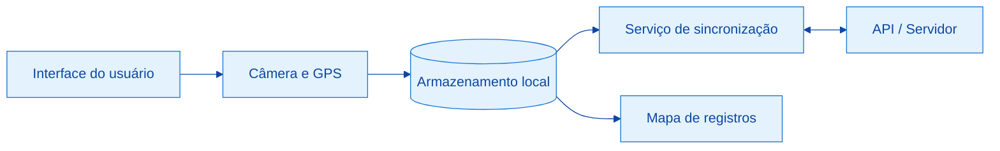

<div align="center">


<br/>


</div>

---

## Sumário

- [Visão geral](#visão-geral)
- [Principais recursos](#principais-recursos)
- [Arquitetura](#arquitetura)
- [Tecnologias](#tecnologias)
- [Pré-requisitos](#pré-requisitos)
- [Instalação](#instalação)
- [Configuração](#configuração)
- [Permissões](#permissões)
- [Uso](#uso)
- [Estrutura do projeto](#estrutura-do-projeto)
- [Testes](#testes)
- [Segurança e privacidade](#segurança-e-privacidade)
- [Roadmap](#roadmap)
- [Contribuição](#contribuição)
- [Licença](#licença)
- [Contato](#contato)

---

## Visão geral

<!-- AJUSTE: acrescente 1 frase sobre o contexto real de uso (ex.: inspeção de ativos, vistoria, auditoria de campo) -->
O **Geo Sync Mobile** é um aplicativo Flutter para equipes de campo. Ele permite registrar fotos associadas às coordenadas GPS do momento da captura, visualizar os registros em mapa e sincronizá-los com um servidor central via API.

Uma única base de código atende Android e iOS, o que garante paridade funcional entre as plataformas e reduz o custo de manutenção.

## Principais recursos

<!-- AJUSTE: mantenha apenas o que o app realmente faz hoje -->
| Recurso | Descrição |
|---|---|
| Captura de imagens | Registro de fotos pela câmera ou seleção pela galeria |
| Captura de localização | Obtenção de latitude e longitude do dispositivo em cada registro |
| Visualização em mapa | Exibição dos registros como marcadores em mapa interativo |
| Sincronização | Envio dos registros ao servidor via HTTPS |
| Armazenamento local | Persistência de dados e preferências no dispositivo |
| Compartilhamento | Exportação de registros pelo menu nativo do sistema |

## Arquitetura

<!-- AJUSTE: adapte o diagrama ao fluxo real do seu app -->

```mermaid
%%{init: {'theme':'base','themeVariables':{'primaryColor':'#E3F2FD','primaryBorderColor':'#1976D2','primaryTextColor':'#0D47A1','lineColor':'#0D47A1','secondaryColor':'#BBDEFB'}}}%%
flowchart LR
    A[Interface do usuário] --> B[Câmera e GPS]
    B --> C[(Armazenamento local)]
    C --> D[Serviço de sincronização]
    D <--> E[API / Servidor]
    C --> F[Mapa de registros]
```

**Fluxo resumido:** a interface captura a foto e a localização do dispositivo, o registro é gravado localmente e o serviço de sincronização o envia à API. Os registros salvos também são exibidos no mapa.

## Tecnologias

| Finalidade | Tecnologia |
|---|---|
| Aplicativo | Flutter / Dart (`^3.10.8`) |
| Mapas | `flutter_map`, `latlong2` |
| Localização | `geolocator` |
| Câmera e galeria | `image_picker` |
| Comunicação | `http` (REST API) |
| Armazenamento local | `shared_preferences`, `path_provider` |
| Compartilhamento | `share_plus` |
| Qualidade | `flutter_lints`, `flutter_test`, `integration_test` |
| Controle de versão | Git e GitHub |

## Pré-requisitos

Antes de começar, verifique se você possui instalado:

- [Git](https://git-scm.com/) 2.30 ou superior
- [Flutter SDK](https://docs.flutter.dev/get-started/install) (canal estável, compatível com Dart `^3.10.8`)
- Android Studio ou Xcode, com emulador ou dispositivo físico configurado

Confira o ambiente com `flutter doctor`.

## Instalação

```bash
# Clonar o repositório
git clone https://github.com/mariaclaraluz0/geo_sync_mobile.git

# Acessar o diretório do projeto
cd geo_sync_mobile

# Instalar as dependências
flutter pub get
```

## Configuração

<!-- AJUSTE: confirme onde a URL da API é definida hoje no código e ajuste esta seção -->
A URL da API é informada em tempo de execução, sem versionar valores sensíveis:

```bash
flutter run --dart-define=API_BASE_URL=https://sua-api.exemplo.com
```

```dart
const apiBaseUrl = String.fromEnvironment('API_BASE_URL');
```

> **Importante:** nunca versione chaves, tokens ou URLs de produção no repositório.

## Permissões

| Plataforma | Arquivo | Permissões |
|---|---|---|
| Android | `android/app/src/main/AndroidManifest.xml` | `INTERNET`, `ACCESS_FINE_LOCATION`, `ACCESS_COARSE_LOCATION`, `CAMERA` |
| iOS | `ios/Runner/Info.plist` | `NSLocationWhenInUseUsageDescription`, `NSCameraUsageDescription`, `NSPhotoLibraryUsageDescription` |

## Uso

```bash
# Executar em modo de desenvolvimento
flutter run --dart-define=API_BASE_URL=<url-da-api>

# Gerar build de produção (Android)
flutter build apk --release

# Gerar bundle para a Play Store
flutter build appbundle --release

# Gerar build iOS
flutter build ipa --release
```

## Estrutura do projeto

<!-- AJUSTE: detalhe a pasta lib/ conforme a estrutura real -->
```
geo_sync_mobile/
├── android/             # Projeto nativo Android
├── ios/                 # Projeto nativo iOS
├── assets/              # Logo e recursos estáticos
├── lib/                 # Código-fonte da aplicação
├── test/                # Testes unitários e de widget
├── integration_test/    # Testes de integração
├── pubspec.yaml         # Dependências e metadados
└── analysis_options.yaml
```

## Testes

```bash
# Análise estática
flutter analyze

# Testes unitários e de widget
flutter test

# Testes de integração
flutter test integration_test
```

## Segurança e privacidade

- Localização e imagens podem ser dados pessoais. O tratamento deve observar a LGPD (Lei nº 13.709/2018).
- Toda comunicação com a API deve ocorrer via HTTPS.
- O `shared_preferences` não é criptografado. Para tokens ou dados sensíveis, utilize armazenamento seguro, como o `flutter_secure_storage`.

## Roadmap

<!-- AJUSTE: marque o que já foi concluído -->
- [x] Estrutura inicial do projeto
- [x] Captura de fotos e localização
- [x] Visualização em mapa
- [ ] Captura de localização em segundo plano
- [ ] Sincronização incremental
- [ ] Resolução de conflitos de dados
- [ ] Exportação de dados (CSV/GeoJSON)
- [ ] Autenticação de usuários
- [ ] Testes de integração abrangentes

## Contribuição

Contribuições são bem-vindas. Para colaborar:

1. Faça um fork do repositório.
2. Crie uma branch a partir da `main`: `git checkout -b feature/nome-da-feature`
3. Realize os commits seguindo o padrão [Conventional Commits](https://www.conventionalcommits.org/pt-br/): `git commit -m "feat: descrição da alteração"`
4. Envie a branch: `git push origin feature/nome-da-feature`
5. Abra um Pull Request descrevendo as mudanças realizadas.

## Licença

Distribuído sob a licença MIT. Consulte o arquivo [LICENSE](LICENSE) para mais informações.

## Contato

**Maria Clara Luz**

[](https://github.com/mariaclaraluz0)

Link do projeto: [github.com/mariaclaraluz0/geo_sync_mobile](https://github.com/mariaclaraluz0/geo_sync_mobile)

---

<div align="center">
<sub>Desenvolvido por Maria Clara Luz</sub>
</div>
